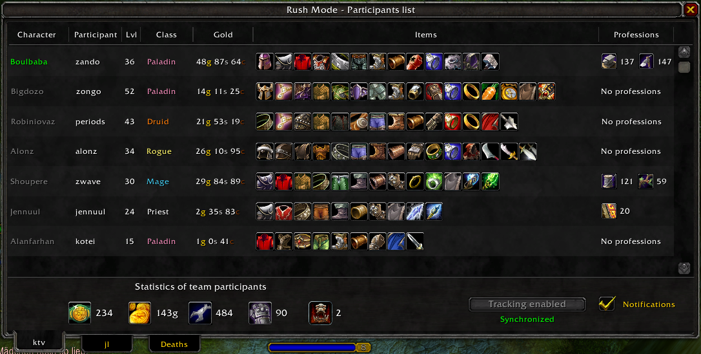
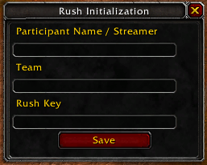
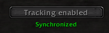

# 🌟 **Rush Mode – WoW HC Addon**



Rush Mode is a World of Warcraft Classic addon designed to **coordinate**, **track**, and **secure** competitive **rush events** involving multiple players, streamers, and teams.

**Primary Goals:**

- **Synchronized** progression tracking across characters and rerolls
- **Anti-fraud** mechanisms for trades and mail
- **Fair play** enforcement through shared trust (whitelist) and guild-based communication
- **Event auditing** for administrators and organizers

This addon supports French and English language.

---

## 📚 **Table of Contents**

1. **Overview**
2. **Installation**
3. **Initial Setup** (`/rinit`)
4. **Character Tracking**
5. **Whitelist & Synchronization** (`/rconnect`)
6. **Guild Requirement & Communication Caveats**
7. **Status Indicators**
8. **Rules & Anti-Fraud System**
9. **Commands Reference**
10. **Important Warnings**
11. **External Integration** (Discord / Twitter)
12. **Contact & Support**

---

## 1. Overview

Rush Mode allows a group of players (often streamers) to engage in a **shared rush** with strict rules:

- track **full leveling** to 60
- Completing **objectives** related to professions, levels, and dungeons
- Preventing **external assistance** (gold and items from mail or trades)

All critical actions are **tracked locally** and **securely shared** between rush members.

---

## 2. 🛠️ **Installation (if not using Curseforge)**

1. **Download** the addon
2. **Place** it into:

```
World of Warcraft/_classic_era_/Interface/AddOns/Rush_Mode
```

3. **Launch** WoW Classic
4. Ensure **Rush Mode** is **enabled** in the AddOns menu

---

## 3. 🚀 **Initial Setup** – `/rinit`

The first mandatory step is **initialization**.

**Run the following command in game:**

```
/rinit
```

This opens an initialization window.  


You must provide:

- **Streamer / Participant Name**
- **Team Name**
- **Rush Key**

### 🔑 **Important – Rush Key**

The Rush Key must remain **strictly secret**.

- **Share** it only with official rush members
- It grants **access** to rush participation
- Anyone with this key can potentially **join** the rush

Once saved, this step **does not need to be repeated** for this rush.

---

## 4. 🔍 **Character Tracking**

After initialization, you can **activate tracking**:

- On your **current character**
- On **additional characters** (rerolls)

Once tracking is enabled:

- It **cannot be disabled**
- This prevents **abuse** (e.g. opting out after suspicious actions)

---

## 5. 🔗 **Whitelist & Synchronization** – `/rconnect`

If this is your **first character** participating in the rush, you must **connect** it with another rush member.

**Command:**

```
/rconnect <playerName>
```

This will:

- **Exchange** and **synchronize** the whitelist
- Establish **trusted communication**

### 🔄 **Rerolls**

After the first successful connection:

- **Rerolls** automatically receive the whitelist
- No additional manual connection is required

---

## 6. 🏰 **Guild Requirement & Communication Caveats**

### ⚠️ **Mandatory Guild Requirement**

All rush participants must be in the **same guild**.

Guild communication is required for:

- **Tracking**
- **Synchronization**
- **Anti-fraud data exchange**

### ⚙️ **Known WoW Classic Limitation**

When joining a guild, WoW Classic does **not properly reinitialize** addon communication GUILD channels.

#### ⚡ **Impact**

- Tracking may appear **partially functional**
- Synchronization may be **degraded**

#### 🔄 **Required Action (one-time only)**

After **joining the guild**:

1. **Log out**
2. **Log back in**

This fully **resets** the communication system.  
Once done, no further action is required on this character.

---

## 7. ✅ **Status Indicators**

If everything is configured correctly, you should see the following state:  


- **🟢 – Synchronized**

  - Whitelist **populated**
  - Communication **operational**

- **🔴/🟡 – Not synchronized**
  - Whitelist **empty** or **incomplete**
  - Tooltip explains **what is missing**

---

## 8. 🛡️ **Rules & Anti-Fraud System**

### **Core Rules**

Participants must:

- **Reach level 60**
- Complete **rush-defined objectives** (levels, professions, dungeons...)

### **Anti-Fraud Enforcement**

If you accept:

- **Trades**
- **Mail** (gold or items)

From **non-rush participants**, the action will be:

- **Logged**
- Shared with **administrators**
- **Reviewed and adjudicated** if necessary

This includes:

- **Partial trades**
- **Progressive withdrawals**
- **Mail-based assistance**

Once tracking is enabled, all actions are **monitored automatically**.

---

## 9. 📝 **Commands Reference**

### **Identity**

You can **change your team** at any time.

```
/rjoin <team>
```

### **Synchronization**

You can **synchronize** your whitelist with new players at any time.

```
/rconnect <playerName>
```

### **Reset Addon**

Use it only if Rush is finished and you want to **start another one**. If others are
still in the rush, they will continue to receive your character's data because it is still in the whitelist.

```
/rreset
/rinit
```

---

## 10. ⚠️ **Important Warnings**

### 🪦 **Character Death**

If your character dies:

**🚫 DO NOT DELETE IT**

Reason:

- The whitelist is based on **character name**
- If someone reuses the same name and joins the guild:
  - They will be **incorrectly whitelisted**
  - This compromises the **rush integrity**

Always keep **dead characters** intact.

---

## 11. 🔗 **External Integration** (Discord / Twitter)

Rush Mode can be **extended** to support real-time external tracking and tooling.

If you want to:

- Build **live dashboards**
- **Moderate events** externally
- Exploit rush data **outside the game**

**Contact me via:**

- **Discord**: zando7914
- **Twitter / X**: [zandodev](https://x.com/zandodev)

I am open to collaboration for **advanced or custom event setups**.
As I did for the KTV x JL Rush Event organized by [Kameto](https://www.twitch.tv/kamet0).

---

## 12. 📞 **Contact & Support**

If you encounter:

- **Synchronization issues**
- **False positives**
- **Technical limitations**
- **Custom event requirements**

Please reach out via **Discord** or **Twitter**.

---

### 📝 **Final Notes**

Rush Mode is **not a casual addon**.

It assumes:

- **Trust** between participants
- **Respect** for the rules
